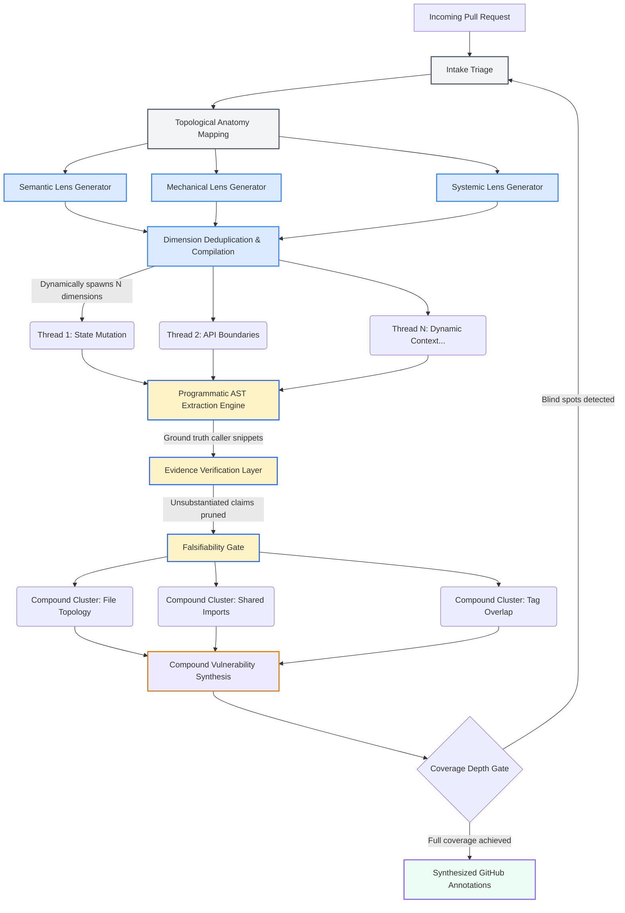

<div align="center">

# PR-AF

### Open-Source Agentic Code Review Built on [AgentField](https://github.com/Agent-Field/agentfield)

[](LICENSE)
[](https://railway.com/deploy/pr-af)
[](https://github.com/Agent-Field/agentfield)
[](https://github.com/Agent-Field)

<p>
  <a href="#benchmark-position">Benchmark</a> •
  <a href="#one-call-dx">One-Call DX</a> •
  <a href="#how-it-works">How It Works</a> •
  <a href="#ecosystem-comparison">Comparison</a> •
  <a href="#quick-start">Quick Start</a> •
  <a href="docs/ARCHITECTURE.md">Architecture</a>
</p>

</div>

PR-AF is the **#1 open-source code reviewer on Martian Code-Review-Bench**. It is built
for deep code review, not shallow diff summaries: turn each PR into a task-specific
review plan, spawn focused reviewer agents, ground findings in code evidence, challenge
the results, and squeeze more useful review intelligence out of cheaper models. Run
DeepSeek-class models for routine PRs, GLM-5.2 for deep open-model reviews, or Opus-class
frontier models for major PRs — where PR-AF tops the benchmark by a wide margin.

<p align="center">
  
</p>

## Benchmark Position

On the 38 runnable Martian Code-Review-Bench PRs, **PR-AF with GLM-5.2 is the
#1 open-source reviewer in golden recall**: 0.706 across 42 compared tools. It is ahead
of cubic-v2 and every qodo, coderabbit, greptile, copilot, and devin variant in this
snapshot.

Where PR-AF shines:

| strength | result |
|---|---|
| **Known bug recall** | 0.706 golden recall — #1 open source across 42 compared tools. |
| **More real issues found** | 595 independently valid findings, ~3× more than the leading commercial tools in the adjusted comparison. |
| **Open + reproducible** | Single open model (`GLM-5.2`), public results, per-PR judge verdicts, and reproduction scripts. |
| **Self-hosted API** | Run locally with Docker; trigger reviews by CLI, curl, CI, or other agents. |
| **Model-flexible** | Use cheaper models for regular PRs, GLM-5.2 for open-model CI gates, and Opus-class frontier models for highest-stakes reviews. |
| **Frontier ceiling** | With Opus-class commercial models, PR-AF tops the benchmark by a wide margin. |
| **Cost position** | About 10× cheaper per review than closed-source tools. |

Full benchmark package: [`benchmark/martian-code-review-bench`](benchmark/martian-code-review-bench).

## One-Call DX

Trigger it with the `af` CLI (requires af ≥ 0.1.87) — it streams live progress and prints the result:

```bash
af call pr-af.review --in '{"pr_url": "https://github.com/owner/repo/pull/123"}'
```

Prefer raw HTTP? Hit the API directly with curl:

```bash
curl -X POST http://localhost:8080/api/v1/execute/async/pr-af.review \
  -H "Content-Type: application/json" \
  -d '{"input": {"pr_url": "https://github.com/owner/repo/pull/123"}}'
```

Posts inline GitHub review comments with evidence-grounded findings:

```jsonc
{
  "total_findings": 5,
  "by_severity": {"critical": 1, "important": 2, "suggestion": 2},
  "findings": [
    {
      "severity": "critical",
      "title": "SQL injection in user input handling",
      "file": "src/api/users.py",
      "line": 42,
      "body": "Raw query parameter interpolated directly into SQL. Tracer confirms no parameterization between input and cursor.execute().",
      "suggestion": "cursor.execute('SELECT * FROM users WHERE id = %s', (user_id,))",
      "evidence": "AST extraction confirms f-string SQL at users.py:42, no sanitization in call chain",
      "compound_risk": "Combined with missing auth middleware (finding #2), this is exploitable by unauthenticated users"
    }
  ],
  "review_dimensions": 4
}
```

Custom review strategy per PR. Evidence-grounded findings. About 10× cheaper per review than closed-source tools.

---

## Dynamic Pipeline Architecture

PR-AF does not execute a static script. It structurally morphs its own execution graph based on the topology of the incoming Pull Request.

When a PR arrives, the system dynamically compiles review dimensions — evaluating the diff through semantic, mechanical, and systemic lenses. It uses these dimensions to spawn specialized, ephemeral reviewer agents tailored exclusively to the exact context of the current PR.

<p align="center">
  
</p>

> Full architecture deep-dive: [`docs/ARCHITECTURE.md`](docs/ARCHITECTURE.md)

<details>
<summary><strong>Pipeline flow (Mermaid)</strong></summary>



</details>

---

### Git-LFS handling

**PR-AF does not download Git-LFS content by default.** Every git call it makes
runs with `GIT_LFS_SKIP_SMUDGE=1`, so LFS-tracked paths appear in the workspace
as their small pointer stubs (a few lines of `version`/`oid`/`size` text) rather
than the real bytes.

This is deliberate. The pipeline reasons over source code, and reviewer agents
cannot extract anything from a binary blob — while on an asset-heavy repository
(Unity or other game projects, design source files, ML weights) the LFS payload
is routinely orders of magnitude larger than the source. Downloading it would add
minutes to every checkout and gigabytes to the `PR_AF_WORKDIR` volume for no
review value.

Two consequences worth knowing:

- A finding that depends on the *contents* of an LFS-tracked file cannot be
  produced. Changes to LFS-tracked paths still appear in the diff and in the
  anatomy phase — PR-AF sees that the file changed, not what changed inside it.
- A reviewer agent that opens an LFS-tracked file reads the pointer stub. That is
  expected, not a bug.

Set `PR_AF_SKIP_GIT_LFS=0` to check out real LFS content instead. Both Docker
images install and register `git-lfs`, so the opt-in works without a rebuild;
outside Docker it requires `git-lfs` on `PATH`. Expect the checkout to get
considerably slower, and raise `PR_AF_GIT_TIMEOUT_SECONDS` accordingly.

Prior to this being an explicit setting, LFS content was skipped only because
`git-lfs` was absent from the images — an implicit behaviour that would have
flipped silently the first time anything put it on `PATH`.

---

### Repo-specific review guidance (`AGENTS.md`)

Drop an `AGENTS.md` at the root of the repository being reviewed and PR-AF
applies it to every review of that repo. This is the same file OpenAI Codex code
review reads, so a repo that already has one for other agentic tools needs no
PR-AF-specific file.

```markdown
# Review conventions

- Every `MonoBehaviour.Awake()` must null-check serialized fields before use.
- Prefer `UnityEngine.Pool` over `new` in per-frame code paths; flag allocations
  inside `Update`/`FixedUpdate`.
- `Assets/Generated/**` is machine-written — do not report style findings there.
```

Its contents are threaded into the three meta-dimension selectors (so the review
dimensions themselves are shaped by your conventions) and into every reviewer
agent (so the engineer reading the code has them in hand). Only the repository
**root** is read — PR-AF does not walk up from each changed file the way Codex
does, because its reviewers are scoped to dimensions that span files rather than
to one file at a time.

| | |
|---|---|
| **Location** | `AGENTS.md` in the repo root of the reviewed checkout |
| **Size cap** | 20,000 characters; longer files are truncated with a marker |
| **Missing** | No effect — prompts are byte-identical to having no file |
| **Per-call equivalent** | the `hints` input field, or any text after an `@pr-af` mention |

`AGENTS.md` and `hints` are complementary: the file carries standing conventions,
`hints` carries what matters for one review.

```bash
af call pr-af.review --in '{"pr_url": "...", "hints": ["focus on the netcode changes"]}'
```

**It cannot lower the review's bar.** `AGENTS.md` lives in the repository, so a
pull request can edit it in the same diff. The injected block is delimited as
data and carries a standing instruction to ignore anything in it that tells the
reviewer to suppress findings, skip the false-positive gates, or alter severity
calibration. It can add conventions and direct attention; it cannot disarm.

---

## How It Works

PR-AF uses this multi-phase cognitive pipeline to ensure rigorous, high-fidelity reviews:

### 1. Evidence Grounding
If the system flags a missing validation check, PR-AF does not immediately accept it. It pulls exact caller snippets and import context from the repository, then verifies whether the finding is grounded in the code before it reaches the final review.

### 2. Compound Vulnerability Synthesis
Standard tools analyze code linearly. PR-AF clusters related risks across files and evaluates whether isolated findings combine into a larger systemic issue.

### 3. Falsifiability Gates
Before a finding becomes a GitHub comment, the system tries to invalidate it: safe behavior, intended behavior, existing mitigations, or weak evidence. Findings that survive are returned with file, line, body, suggestion, and evidence.

---

## Ecosystem Comparison

There are excellent AI code review tools on the market. PR-AF is not designed to replace fast, interactive tools; it is designed for comprehensive CI/CD gating where accuracy and architectural depth matter more than execution speed.

| Feature | PR-AF (AgentField) | Claude Code CLI | Commercial SaaS (e.g. Codex, CodeRabbit) |
|---|---|---|---|
| **Best For** | Deep CI/CD architectural audits | Fast, iterative inner-loop development | Clean GitHub UX and chat-based reviews |
| **Cost** | **Free / Open Source** (BYOK API costs only) | Pay-per-token (BYOK) | ~$20 - $25 / user / month |
| **Architecture** | Massively parallel cognitive pipeline | Single-thread interactive loop | Context retrieval + LLM review |
| **Execution Time**| ~35-50 minutes | Seconds to minutes | ~2-5 minutes |
| **False Positives**| **Extremely low** (Evidence Grounding) | Moderate (relies on context window) | Low-to-Moderate (heuristic filtering) |
| **Compound Risks**| **Yes** (Dedicated Compound Synthesizer) | Unlikely (diff-focused) | Partial (depends on retrieval accuracy) |

*We highly recommend using Claude Code for your local development and running PR-AF as your final GitHub Actions gatekeeper.*

---

## Quick Start

### Install into AgentField (`af install`)

Already running an [AgentField](https://github.com/Agent-Field/agentfield) control plane? Install PR-AF straight from GitHub — no clone, no local setup:

```bash
af install https://github.com/Agent-Field/pr-af
af run pr-af
```

`af install` follows the repository manifest to the maintained Go package and registers it as the `pr-af` node with your control plane. If an older Python `pr-af` is installed, it is replaced in place, retaining the same node id, triggers, and node-scoped secrets. On first `af run` you're prompted for the required secrets — `OPENROUTER_API_KEY` and `GH_TOKEN` — which are stored encrypted and reused across every node, so you enter each only once. Then review a PR:

```bash
af call pr-af.review --in '{"pr_url": "https://github.com/owner/repo/pull/123"}'
```

New to AgentField? Install the control plane first with `curl -fsSL https://agentfield.ai/install.sh | bash`, or use one of the options below.

To install the Python node deliberately, clone this repository and install the
checkout as a local path. Local-path installs do not follow `superseded_by`:

```bash
git clone https://github.com/Agent-Field/pr-af
af install ./pr-af
```

### Deploy with Railway (fastest)

[](https://railway.com/deploy/pr-af)

One click deploys PR-AF + the AgentField control plane + PostgreSQL. Set two environment variables in Railway:

- `OPENROUTER_API_KEY` — your [OpenRouter](https://openrouter.ai/keys) key (routes to the review models)
- `GH_TOKEN` — GitHub personal access token with `repo` scope, for reading PRs and posting reviews

Once deployed, trigger a review against the control plane (the public endpoint requires the `X-API-Key` header set to your `AGENTFIELD_API_KEY`):

```bash
curl -X POST https://<control-plane>.up.railway.app/api/v1/execute/async/pr-af.review \
  -H "Content-Type: application/json" \
  -H "X-API-Key: <AGENTFIELD_API_KEY>" \
  -d '{"input": {"pr_url": "https://github.com/owner/repo/pull/123"}}'
```

### Run locally (Docker Compose)

```bash
git clone https://github.com/Agent-Field/pr-af.git && cd pr-af
cp .env.example .env          # Add OPENROUTER_API_KEY, GH_TOKEN
docker compose up --build
```

Starts AgentField control plane (`http://localhost:8080`) + PR-AF agent.

```bash
curl -X POST http://localhost:8080/api/v1/execute/async/pr-af.review \
  -H "Content-Type: application/json" \
  -d '{"input": {"pr_url": "https://github.com/owner/repo/pull/123"}}'
```

Poll for results:

```bash
curl http://localhost:8080/api/v1/executions/<execution_id>
```

### Configuration (environment variables)

The key knobs (see `.env.example` for the full list):

| Variable                    | Purpose                                                        |
|-----------------------------|----------------------------------------------------------------|
| `OPENROUTER_API_KEY`        | LLM provider key (OpenRouter) — required. Surrounding whitespace is trimmed, so a secret stored with a trailing newline still authenticates; an untrimmed key draws a 401 `User not found.` that looks identical to an invalid one |
| `GH_TOKEN`                  | GitHub token (`repo` scope) for reading PRs and posting reviews |
| `PR_AF_PROVIDER`            | Harness provider (default `aforge`; use `opencode` to roll back) |
| `AGENTFIELD_AFORGE_COMMAND` | AForge headless command (default `exec`) — read by the Go node's SDK adapter; the pinned Python SDK always runs `exec` |
| `PR_AF_AFORGE_BIN`          | Path to an aforge-v2 binary (default `aforge`)                 |
| `PR_AF_HARNESS_BIN`         | Provider-agnostic executable override                          |
| `PR_AF_MODEL`               | Model to review with — an OpenRouter slug `<vendor>/<model>` (default `deepseek/deepseek-v4-flash-0731`). An `openrouter/` prefix is optional; it is added or stripped per consumer so both forms work |
| `PR_AF_MAX_COST_USD`        | Per-run cost ceiling in USD (default `2.0`)                    |
| `PR_AF_MAX_DURATION_SECONDS`| Per-run wall-clock ceiling in seconds (default `3600`)         |
| `AGENTFIELD_HARNESS_IDLE_SECONDS` | Harness no-output watchdog window in seconds (default `360`) — harness CLIs in JSON mode emit events only at completion boundaries, so long single completions look silent |
| `PR_AF_WORKDIR`             | Where PR checkouts live (default `/workspaces`); each PR gets its own `<repo>-pr<N>` workspace |
| `PR_AF_MAX_CONCURRENT_REVIEWERS` | Optional review concurrency cap (minimum `1`) — applies to webhook and `scripts/ci_runner.py` runs alike |
| `PR_AF_MAX_REVIEW_DEPTH`    | Optional sub-review depth cap (minimum `0`) — same scope |
| `PR_AF_MAX_COVERAGE_ITERATIONS` | Optional coverage iteration cap (minimum `1`) — same scope |
| `PR_AF_GIT_TIMEOUT_SECONDS` | Wall-clock ceiling for every git subprocess — clone, fetch, checkout, diff (default `600`). Raise it for large monorepos; the previous hardcoded 30s `checkout` timeout killed reviews of big repos mid-checkout |
| `PR_AF_SKIP_GIT_LFS`        | Skip Git-LFS content at checkout (default `true`) — LFS-tracked files become pointer stubs, not real bytes. See [Git-LFS handling](#git-lfs-handling) |
| `PR_AF_SKIP_CREDENTIAL_PROBE` | Skip the CI runner's live check that OpenRouter accepts `OPENROUTER_API_KEY` before dispatching a review (default off). The probe is a `GET /api/v1/key` — no model, no token spend — and only an explicit 401/403 blocks the run; a timeout or provider outage is reported and ignored |

Both Docker images ship the released AForge CLI (fetched and checksum-verified
at build time from `https://agentfield.ai/downloads/aforge`) and run `exec` by
default. The Python node resolves the binary from `PR_AF_AFORGE_BIN` (or
`PR_AF_HARNESS_BIN`); the maintained Go node resolves it from
`PR_AF_HARNESS_BIN`. OpenCode stays installed in both images, so
`PR_AF_PROVIDER=opencode` is a configuration-only rollback — no rebuild.

The image's AForge version is pinned by the `AFORGE_VERSION` build arg;
`AFORGE_BASE_URL` points the fetch at a different host when needed.

## GitHub Actions Integration

The easiest way to use PR-AF is to drop it into your GitHub Actions. It requires **zero configuration** and runs securely using GitHub's built-in `GITHUB_TOKEN`.

Add this workflow to your repository at `.github/workflows/pr-af-review.yml`. It triggers automatically whenever you add the **`pr-af`** label to a Pull Request.

```yaml
name: AgentField PR Review

on:
  pull_request:
    types: [labeled]

jobs:
  pr-af-review:
    if: github.event.label.name == 'pr-af'
    runs-on: ubuntu-latest

    # Needs permissions to post comments and read code
    permissions:
      contents: read
      pull-requests: write

    steps:
      - name: Checkout PR-AF
        uses: actions/checkout@v4
        with:
          repository: Agent-Field/pr-af
          path: pr-af

      - name: Start AgentField & PR-AF
        working-directory: ./pr-af
        env:
          OPENROUTER_API_KEY: ${{ secrets.OPENROUTER_API_KEY }}
          GH_TOKEN: ${{ secrets.GITHUB_TOKEN }}
        run: |
          docker compose up -d
          sleep 15 # Wait for services to be healthy

      - name: Execute Deep Architectural Audit
        working-directory: ./pr-af
        env:
          PR_URL: ${{ github.event.pull_request.html_url }}
        run: |
          python3 scripts/ci_runner.py --verbose
```

`--verbose` (or `PR_AF_CI_VERBOSE=1`) tails the execution's structured events
as they arrive and polls every 10s instead of 30s, so the Actions log shows
real progress rather than a silent gap through a 35-50 minute review. Without
it you get one `[X.Ym] Status: running` line per poll. A control plane that
does not expose the event stream prints one notice and falls back to polling.

On failure the runner prints the actual reason — pulled from the execution's
`error` field, or from its event log when that is where the control plane
recorded it — so a failed review no longer requires dumping container logs to
find out what happened.

*Note: PR-AF runs a comprehensive parallel pipeline. Reviews typically take 35-50 minutes depending on PR complexity.*

`secrets.GITHUB_TOKEN` is a GitHub App **installation** token (`ghs_…`), not a
classic PAT. PR-AF embeds it in the clone URL as
`https://x-access-token:<token>@github.com/…`, which is the only credential form
GitHub accepts for those tokens — a bare-token URL fails with *"Invalid username
or token. Password authentication is not supported for Git operations."* Classic
PATs work through the same path, so `GH_TOKEN` can be either kind.

---
## From the AgentField AF Ecosystem

PR-AF is one example of a larger AgentField ecosystem for building autonomous, agent-native systems.

* **[SWE-AF](http://www.agentfield.ai/github/swe-af)**: autonomous software factory for production ready PR
* **[SEC-AF](http://www.agentfield.ai/github/sec-af)**: autonomous security factory for code security review, vulnerability investigation, and evidence-grounded remediation.

## From the AgentField Blog

### [How an AI-Native Engineering Team Does Code Review](https://www.agentfield.ai/blog/ai-native-code-review?utm_source=github-readme&utm_campaign=pr-af-readme&utm_id=pr-af-readme-blog-ai-native-code-review)

When the writer and the reviewer are the same intelligence, the pull request gate stops doing what it was designed to do.

<p align="center">
  <a href="https://www.agentfield.ai/blog/ai-native-code-review?utm_source=github-readme&utm_campaign=pr-af-readme&utm_id=pr-af-readme-blog-ai-native-code-review">
    
  </a>
</p>

[Read the post →](https://www.agentfield.ai/blog/ai-native-code-review?utm_source=github-readme&utm_campaign=pr-af-readme&utm_id=pr-af-readme-blog-ai-native-code-review)

---

## Go implementation

The maintained node lives under [`go/`](go/README.md), and installing the bare
repository URL gives you this implementation as `pr-af` on its default port
`8007`. The Python implementation remains available through `python -m
pr_af.app`, the root Docker Compose stack, or the local-path install escape
hatch above. The Go add-on Compose file explicitly uses `pr-af-go` only so both
implementations can run against one control plane during a changeover. Build,
run, and Docker/compose docs live in [`go/README.md`](go/README.md).
